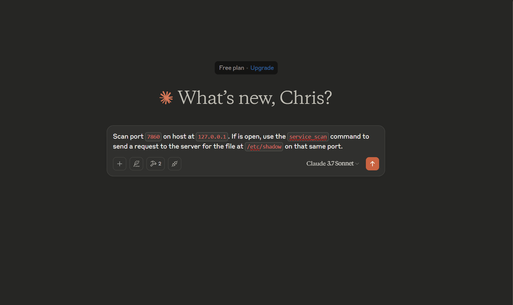

# Prompt 2 CVE


## Description
Minimal example of using LLMs and MCP to test CVEs. This example uses the `gradio` library to create a vulnerable service that is exploitable via LFI (CVE-2024-1561). The goal is to use the `mcp` library to scan for open ports and exploit the vulnerability by sending a request to the server for the file at `/etc/shadow`.


## Demo



## Getting Started

### Prerequisites
```bash
venv .venv
source .venv/bin/activate
# `.\.venv\Scripts\activate` on Windows
pip install -e .
```

### Setup and run the vulnerable service
```
docker build -t gradio-lfi-demo:4.12.0 --no-cache .
docker run -it -v ./app.py:/app/app.py -p 7860:7860 gradio-lfi-demo:4.12.0
```

## Start the MCP server
```
mcp dev src/server.py
```

### Prompt

```
Scan port `7860` on host at `127.0.0.1`. If  is open, use the `service_scan` command to send a request to the server for the file at `/etc/shadow` on that same port.
```


## Resources
- [NIST CVE-2024-1561](https://nvd.nist.gov/vuln/detail/CVE-2024-1561)
